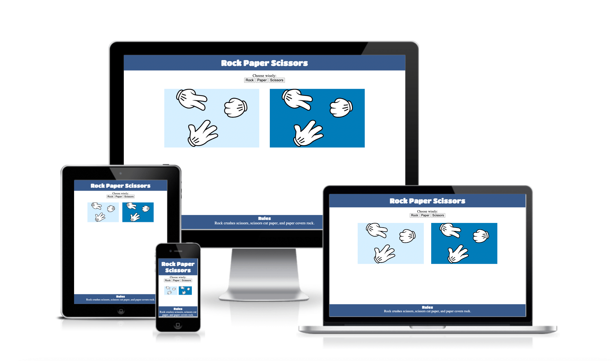
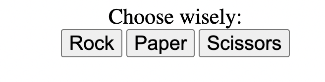
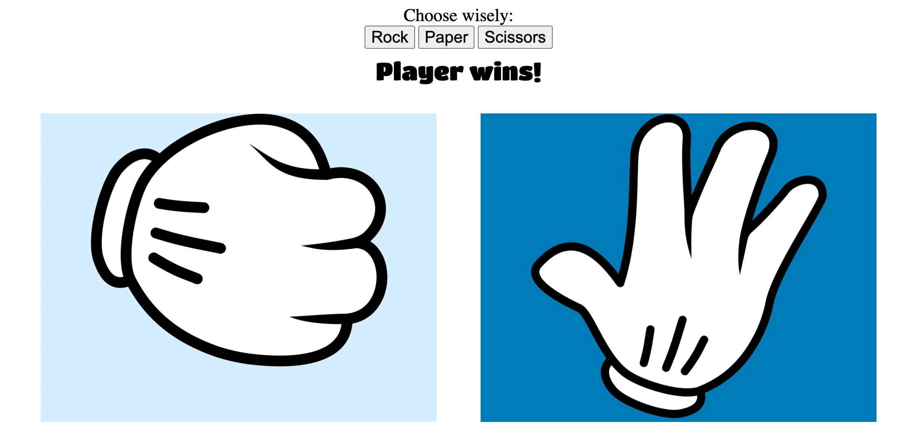
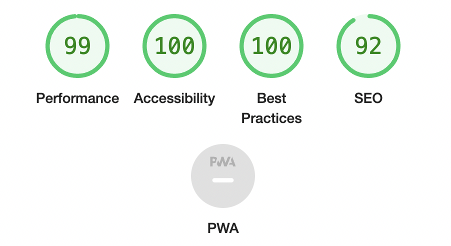
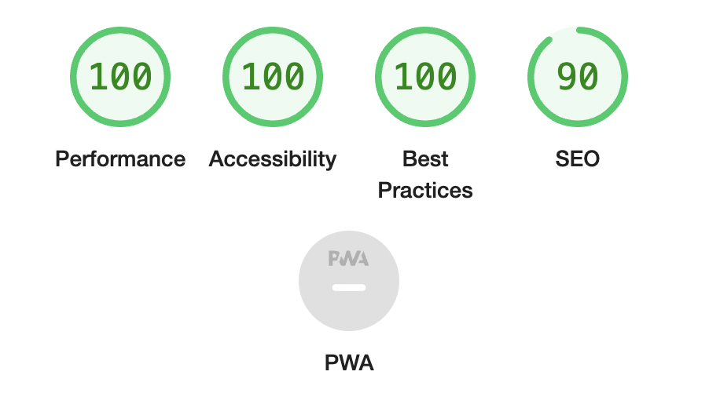

 

# Rock Paper Scissors
- Is a hand game originating from China, usually played between two people, in which each player simultaneously forms one of three shapes with an outstretched hand. These shapes are "rock" (a closed fist), "paper" (a flat hand), and "scissors" (a fist with the index finger and middle finger extended, forming a V). "Scissors" is identical to the two-fingered V sign (also indicating "victory" or "peace") except that it is pointed horizontally instead of being held upright in the air.

- A simultaneous, zero-sum game, it has three possible outcomes: a draw, a win or a loss. A player who decides to play rock will beat another player who has chosen scissors ("rock crushes scissors" or "breaks scissors" or sometimes "blunts scissors"), but will lose to one who has played paper ("paper covers rock"); a play of paper will lose to a play of scissors ("scissors cuts paper"). If both players choose the same shape, the game is tied and is usually immediately replayed to break the tie. The game spread from China while developing different variants in signs over time.

- Rock Paper Scissors is often used as a fair choosing method between two people, similar to coin flipping, drawing straws, or throwing dice in order to settle a dispute or make an unbiased group decision. Unlike truly random selection methods, however, rock paper scissors can be played with a degree of skill by recognizing and exploiting non-random behavior in opponents.
---

### Features
***
#### Existing Features

- Header

    - Located at the top of the page, the header element states the name of the game - Rock Paper Scissors with a font which is both inviting and encouraging the user to give the game a go.
    - The header clearly contrasts with the background, making the text within easily readable.

- #### The Game Options
    - The game options involve an exact instruction and underneath a set of options for the player to choose from in order to initiate the game: **Rock Paper Scissors**.
    - This section offers the user interactive buttons through which he/she can make their choice and play the game.

- The Game Results 
    - When the user selects an option, the corresponding image is shown on the player (left) side of the board.
    - The JavaScript code then chooses a random option for the Computer player, displays the image responding to the computer's choice, after which determines who is victorious.
    - After the conclusion of the game, the winner is revealed to the user right beneath the options button.

- Footer 
    - The footer element contains the rules of _Rock Paper Scissors_.
    - The footer is of importance to the user due to the clear explanation of the game rules.

### Testing
***

- I ran tests that confirmed the game results being always correct.
- I confirmed that the all the page's contents are readable and easy to understand.
- The fonts and colors I have chosen are easy to read and accessible, approved after being ran through Lighthouse in devtools.
    - Lighthouse performance report for **Mobile**:
    
    - Lighthouse performance report for **Desktop**:
    
 - I confirmed that this project is responsive, looks good and functions on all standard screen sizes by using devtools.

 ### Validator Testing

 - HTML
    - No errors were found when passing the HTML code through the official W3C Validator.
 - CSS
    - No errors were found when passing the CSS code through the official Jigsaw Validator.

 ## Deployment
 ***
- The site was deployd to GitHub pages by using the following steps required.
    - In the GitHub repository, navigate to the Settings tab.
    - From the source section drop-down menu select the Main Branch.
    - Once the Main Branch has been selected, the page provided the link to the completed website.

 The live link can be found here   - [Rock Paper Scissors](https://ilyailiev05.github.io/rock-paper-scissors/)

 ## Credits
 ***
 ### Content
 - The Rock Paper Scissors historical origin and gameplay/rules were obtained from Wikipedia.

 ### Media
 - The images used within the game were all obtained from Pinclipart.
 - All images included in the project were rendered through Canva in various ways.
 - The banner image was downloaded from Pixels.com and the banner itself created in Canva and applied to the Readme.md.
 - I designed my Readme file inspired by [Hitesh Choudhary](https://www.youtube.com/watch?v=bpdvNwvEeSE) YT video.

